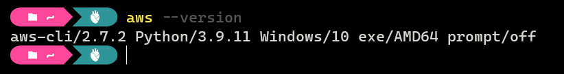
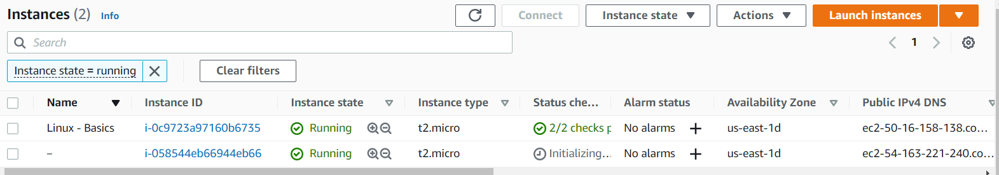
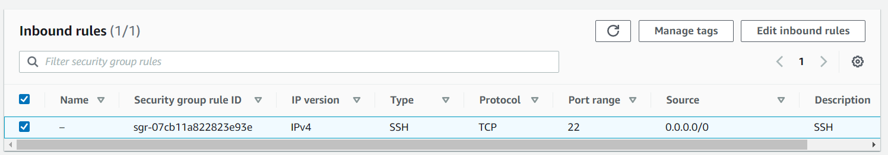
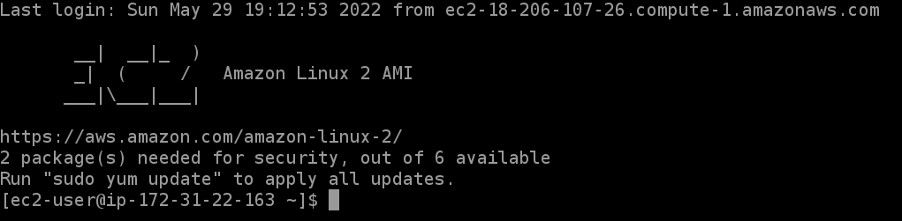
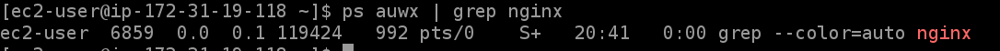

# Optional question 1


## Step 1:

> **Note:** To solve this, I used AWS Command Line Interface (AWS CLI) that runs on my windows machine.
>
> 

the following command line is to create an EC2 server using Amazon linux AMI (Image ID ami-0022f774911c1d690) in the (us-east-1) region with instance type (t2.micro) and the key pair (AZ-EC2) that I created earlier, and then I specify EBS volume with 20 GB.

```shell
$ aws ec2 run-instances
        --image-id ami-0022f774911c1d690
	--instance-type t2.micro
	--key-name AZ-EC2
	--block-device-mappings 'DeviceName=/dev/xvda,Ebs={VolumeSize=20}'
	--placement 'AvailabilityZone=us-east-1d'
```

**Output:**

```json
{
    "Groups": [],
    "Instances": [
        {
            "AmiLaunchIndex": 0,
            "ImageId": "ami-0022f774911c1d690",
            "InstanceId": "i-058544eb66944eb66",
            "InstanceType": "t2.micro",
            "KeyName": "AZ-EC2",
            "LaunchTime": "2022-05-29T20:32:30+00:00",
            "Monitoring": {
                "State": "disabled"
            },
            "Placement": {
                "AvailabilityZone": "us-east-1d",
                "GroupName": "",
                "Tenancy": "default"
            },
            "PrivateDnsName": "ip-172-31-19-118.ec2.internal",
            "PrivateIpAddress": "172.31.19.118",
            "ProductCodes": [],
            "PublicDnsName": "",
            "State": {
                "Code": 0,
                "Name": "pending"
            },
            "StateTransitionReason": "",
            "SubnetId": "subnet-061118af1cc6aee49",
            "VpcId": "vpc-0ae7c37590db4000e",
            "Architecture": "x86_64",
            "BlockDeviceMappings": [],
            "ClientToken": "88dbd3aa-9763-4695-9a5c-d133f30322bc",
            "EbsOptimized": false,
            "EnaSupport": true,
            "Hypervisor": "xen",
            "NetworkInterfaces": [
                {
                    "Attachment": {
                        "AttachTime": "2022-05-29T20:32:30+00:00",
                        "AttachmentId": "eni-attach-0dc05d2869931d1b3",
                        "DeleteOnTermination": true,
                        "DeviceIndex": 0,
                        "Status": "attaching",
                        "NetworkCardIndex": 0
                    },
                    "Description": "",
                    "Groups": [
                        {
                            "GroupName": "default",
                            "GroupId": "sg-0bae608cfe2776e82"
                        }
                    ],
                    "Ipv6Addresses": [],
                    "MacAddress": "0a:e8:05:6d:ef:4d",
                    "NetworkInterfaceId": "eni-02af1d98bb9a29709",
                    "OwnerId": "568935291733",
                    "PrivateDnsName": "ip-172-31-19-118.ec2.internal",
                    "PrivateIpAddress": "172.31.19.118",
                    "PrivateIpAddresses": [
                        {
                            "Primary": true,
                            "PrivateDnsName": "ip-172-31-19-118.ec2.internal",
                            "PrivateIpAddress": "172.31.19.118"
                        }
                    ],
                    "SourceDestCheck": true,
                    "Status": "in-use",
                    "SubnetId": "subnet-061118af1cc6aee49",
                    "VpcId": "vpc-0ae7c37590db4000e",
                    "InterfaceType": "interface"
                }
            ],
            "RootDeviceName": "/dev/xvda",
            "RootDeviceType": "ebs",
            "SecurityGroups": [
                {
                    "GroupName": "default",
                    "GroupId": "sg-0bae608cfe2776e82"
                }
            ],
            "SourceDestCheck": true,
            "StateReason": {
                "Code": "pending",
                "Message": "pending"
            },
            "VirtualizationType": "hvm",
            "CpuOptions": {
                "CoreCount": 1,
                "ThreadsPerCore": 1
            },
            "CapacityReservationSpecification": {
                "CapacityReservationPreference": "open"
            },
            "MetadataOptions": {
                "State": "pending",
                "HttpTokens": "optional",
                "HttpPutResponseHopLimit": 1,
                "HttpEndpoint": "enabled",
                "HttpProtocolIpv6": "disabled",
                "InstanceMetadataTags": "disabled"
            },
            "EnclaveOptions": {
                "Enabled": false
            },
            "PrivateDnsNameOptions": {
                "HostnameType": "ip-name",
                "EnableResourceNameDnsARecord": false,
                "EnableResourceNameDnsAAAARecord": false
            },
            "MaintenanceOptions": {
                "AutoRecovery": "default"
            }
        }
    ],
    "OwnerId": "568935291733",
    "ReservationId": "r-0ca32647750434b56"
}
```



Next, to be able to add SSH connection, I had to modify the security group rules that generated when I created the image. the group ID is (sg-0bae608cfe2776e82) but first I should find the security group rule ID.

The following command line shows how to find the security group rule ID for the group ID (sg-0bae608cfe2776e82):

```shell
$ aws ec2 describe-security-group-rules
	--filter Name="group-id",Values="sg-0bae608cfe2776e82"	
```

**Output:**

```json
{
    "SecurityGroupRules": [
        {
            "SecurityGroupRuleId": "sgr-07cb11a822823e93e",
            "GroupId": "sg-0bae608cfe2776e82",
            "GroupOwnerId": "568935291733",
            "IsEgress": false,
            "IpProtocol": "-1",
            "FromPort": -1,
            "ToPort": -1,
            "CidrIpv4": "0.0.0.0/0",
            "Tags": []
        },
        {
            "SecurityGroupRuleId": "sgr-0a48c059cce15535c",
            "GroupId": "sg-0bae608cfe2776e82",
            "GroupOwnerId": "568935291733",
            "IsEgress": true,
            "IpProtocol": "-1",
            "FromPort": -1,
            "ToPort": -1,
            "CidrIpv4": "0.0.0.0/0",
            "Tags": []
        }
    ]
}
```

So, the security group rule ID is (sgr-07cb11a822823e93e)

Now let's modify the security group rules, and the new rules should be (Protocol=tcp, Port=22).

The following command line shows how I did it:

```shell
$ aws ec2 modify-security-group-rules
	--group-id sg-0bae608cfe2776e82
	--security-group-rules 'SecurityGroupRuleId=sgr-07cb11a822823e93e,SecurityGroupRule={Description=SSH,IpProtocol=tcp,FromPort=22,ToPort=22,CidrIpv4=0.0.0.0/0}'
```

**Output:**

```json
{
    "Return": true
}
```



That's it, this is how I created an EC2 server using Amazon linux AMI of t2.micro type with 20 GB of EBS storage and giving it port 22 public access for SSH.

------

## Step 2:

> **Note:** To solve this , I used EC2 Instance Connect that running in Amazon linux AMI image I gust created.
>
> 

To install an NGINX let's update the software on my instance by run the following command:

```bash
sudo yum update -y
```

Now in order to install NGINX I should the following command:

```bash
 sudo amazon-linux-extras install nginx1
```

Now let's check if NGINX is running

```bash
cd /var/www/html
sudo nano index.html
```
**Output:**

