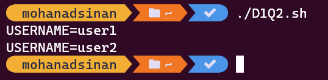
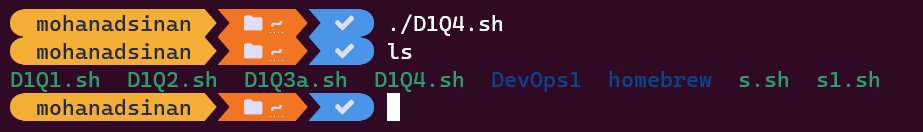
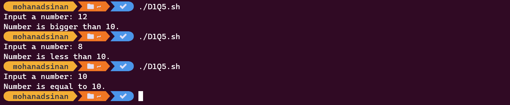
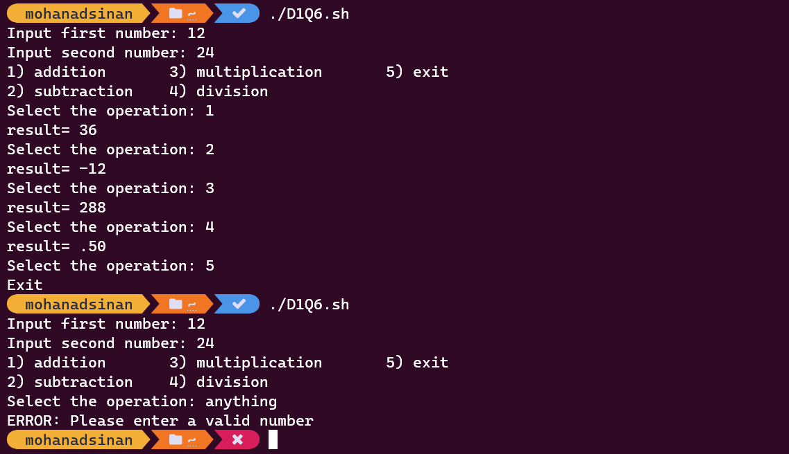

### DevOps

# Day1 - Linux OS, Bash, Shell scripting


1. **Create a user, name it `user1`, switch to `user1`. Now just print the environment variable `DB_URL` value on Linux terminal.**

   ***Ans.***

   ```bash
   #!/bin/bash
   
   # Creating a user with the name user1
   sudo useradd user1
   
   # Switching to user1
   sudo su user1
   
   # Assigning the environment variable "DB _ URL"
   export DB_URL="The value of DB_URL variable"
   
   # Checking the environment variable "DB _ URL"
   echo $DB_URL
   ```
   
      > **Note:**
      >
      > - To run/execute any script, you should add the execute permission to the script file using this command `chmod +x name.sh`.

------


2. **Change the environment variable value. From `USERNAME=user1` to `user2`.**

   ***Ans.***

   ```bash
   #!/bin/bash
   
   # Changing the environment variable values
   export USERNAME=user1
   echo "USERNAME=$USERNAME"
   export USERNAME=user2
   echo "USERNAME=$USERNAME"
   ```
   
   
   
   > **Notes:**
   >
   > - `export` command is used to set the env value.
   > - To re-assign value of env variables you can use `export` command again on the same variable.
   > - The command `echo` is used to output the value of the variable `$USERNAME`.

------


3. **write script for:**

   1. **Create users `user1`, `user2`, `user3`** 
   2. **Assign them passwords `pass1`, `pass2`, `pass3` respectively** 
   3. **Create groups `ec2`, `rds`, `lambda`** 
   4. **Add one user to one group in sequence** 
   5. **Delete `user3` in lambda group.**
   6. **Delete `user2`.**

   ***Ans.***

   ```bash
   #!/bin/bash
   
   # Creating users "user1", "user2", "user3" and assigning them passwords (using for loop)
   for i in 1 2 3
   do
   sudo useradd user$i
   echo -e "pass$i\npass$i" | passwd user$i
   done
   
   # Create groups "ec2", "rds", "lambda" (using for loop)
   for i in "ec2" "rds" "lambda"
   do
   sudo groupadd $i
   done
   
   # Adding "user1" to "ec2" group
   sudo usermod -g ec2 user1
   # Adding "user2" to "rds" group
   sudo usermod -g rds user2
   # Adding "user3" to "lambda" group
   sudo usermod -g lambda user3
   
   # Deleting "user3" from "lambda" group
   sudo gpasswd -d user3 lambda
   
   # Deleting "user2"
   sudo userdel user3
   ```

   
   
   **OTHER SOLUTION**
   
   ```bash
   #!/bin/bash
   
   # Create groups "ec2", "rds", "lambda"
   sudo groupadd ec2
   sudo groupadd rds
   sudo groupadd lambda
   
   # Adding "user1" to "ec2" group
   sudo useradd user1 -g ec2
   # Adding "user2" to "rds" group
   sudo useradd user2 -g rds
   # Adding "user2" to "rds" group
   sudo useradd user3 -g lambda
   
   # Assigning passwords for users "user1", "user2", "user3"
   sudo echo -e "pass1\npass1" | passwd user1
   sudo echo -e "pass2\npass2" | passwd user2
   sudo echo -e "pass3\npass3" | passwd user3
   
   # Deleting "user3" from "lambda" group
   sudo gpasswd -d user3 lambda
   
   # Deleting "user2"
   sudo userdel user3
   ```
   
   > **Notes:**
   >
   > - To add an user, use the command `useradd <username>`.
   > - To change/create an user password, use the command `passwd <username>`.
   > - The option `-e` is used to enable interpretation of backslash `\` escapes.
   > - To add a group, use the command `groupadd <groupname>`.
   > - To change a user main group, use the command `usermod -g <groupname> <username> `.
   > - To create a new user and assign group in one command `useradd -g <groupname> <username>`.
   > - To remove an user from a group, use the option `-d` in the command `gpasswd -d {username groupname`.
   > - To delete an user, use the command `userdel <username>`.
   > - This script should run as root, use the command `sudo` before executing the script.

------


4. **File operations using command line:** 

   1. **Create directories `DevOps1` and `DevOps2`** 

   2. **Create a file named `aws.txt` that contains `Welcome to AWS` to `DevOps1` folder.** 

   3. **Copy `aws.txt` to `DevOps2` folder** 

   4. **Delete the directory `DevOps2`**

   ***Ans.***

   ```bash
   #!/bin/bash
   
   # Creating directories "DevOps1" and "DevOps2"
   mkdir DevOps1
   mkdir DevOps2
   
   # Change the directory to "DevOps1" folder
   cd DevOps1
   
   # Creating a file named "aws.txt" that contains "Welcome to AWS"
   touch aws.txt
   echo Welcome to AWS > aws.txt
   
   # Coping "aws.txt" file to "DevOps2" folder
   cp aws.txt ../DevOps2
   
   # Go back
   cd ..
   
   # Deleting the directory "DevOps2"
   rm -r DevOps2
   ```
   
   
   > **Notes:**
   >
   > - To create a directory, use the command `mkdir`.
   > - To change/go to directory, use the command `cd`.
   > - To create a file, use the command `touch <filename>`.
   > - The command `echo` is used to output a string, and the arrow `>` is used to output the value to a specific file.
   > - To copy a file, use the command `cp <SOURCE> <DESTINATION>`.
   > - To delete a non-empty directory, use the command `rm -r <directory>`

------


5. **Write a script to compare input numbers and print if bigger, lesser or equal to the number 10.**

   ```
   $ ./compare10.sh
   Input a number: 12 
   Number is bigger than 10 
   ```

   ***Ans.***

   ```bash
   #!/bin/bash
   
   # Printing the line "Input a number: "
   echo -n "Input a number: "
   
   # Assigning input value into a variable
   read num
   
   # If statement to compare the user input value with the number 10
   if [[ $num -gt 10 ]]
   then
     echo "Number is bigger than 10."
   elif [[ $num -eq 10 ]]
   then
     echo "Number is equal to 10."
   else
     echo "Number is less than 10."
   fi
   ```
   
   
   
   > **Notes:**
   >
   > - The option `-n` is used to trailing newline is suppressed.
   >
   > - To assign the user inputs to a variable, use the command `read <variablename>`.
   >
   > - If statement takes the following form:
   >
   > ```sh
   >   if TEST-COMMAND
   >   then
   >     STATEMENTS
   >   fi
   > ```


6. **Make a Calculator:**

   1. **Write a script to make a calculator.** 

   2. **Take two input numbers and perform basic operations.** 

   3. **Input 1- add, input 2 - subtract, input 3- multiplication, input 4- division , 5 exit** 

   4. **Maintain the loop until 5 is pressed.**

   ```
   $ ./ca1cLoop.sh
   Input first number: 12
   Input second number: 24
   1) addition			3) multiplication		5) exit
   2) subtraction 		4) division
   Select the operation: 1
   result= 36
   Select the operation: 3
   result= 288
   Select the operation: 5
   ```

   ***Ans.***

    ```bash
   #!/bin/bash
   
   # Take user Input
   echo -n "Input first number: "
   read  a
   echo -n "Input second number: "
   read  b
   
   # Input type of operation
   echo "1) addition       3) multiplication       5) exit"
   echo "2) subtraction    4) division"
   
   # while loop to read user input
   while true
   do
       echo -n "Select the operation: "
       read ch
       
       # Switch Case to perform
       # calculator operations
       case $ch in
           1)
               res=`echo "$a+$b" | bc`
           ;;
           2)
               res=`echo "$a-$b" | bc`
           ;;
           3)
               res=`echo "$a*$b" | bc`
           ;;
           4)
               res=`echo "scale=2 ; $a/$b" | bc`
           ;;
           5)
               echo "Exit"
               exit 0
           ;;
           *)
               echo "ERROR: Please enter a valid number"
               exit 1
           ;;
       esac
       echo "result= $res"
   done
    ```
   

> **Note:**
>
> - Basic Calculator, also known as `bc` is a Linux command-line utility used to perform advanced arithmetic's and algebra in bash scripts. [Read more](https://linuxhint.com/bc-arithmetic-operations-bash/). 


------


7. **Call `function1` and then call `function2` from inside the `function1`. Do the required printing inside the function to express the output and show the function call sequences.**

   ```
   $ ./nested—functions.sh
   This is from the first function 
   This is from the second function 
   ```

   ***Ans.***

   ```bash
   #!/bin/bash
   
   # Creating "function1" that return a string and then call "function2"
   function1() {
       echo "This is from the first function"
       function2
   }
   
   # Creating "function2" that only return a string
   function2() {
       echo "This is from the second function"
   }
   
   # Calling the "function1"
   function1
   ```
   
   > **Notes:**
   >
   > - Bash functions takes the following form:
   >
   >   ```bash
   >   function_name () {
   >     commands
   >   }
   >   ```
   >
   > - To call the function, just write `function_name`.

