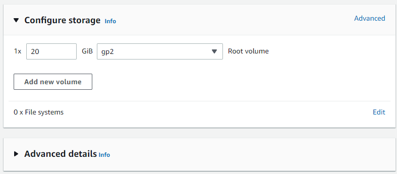

### DevOps

# Day2 - Linux OS, Bash, Shell scripting


1. **PowerShell:**

   1. **Read your name from the console and show it on output.**

   ***Ans.***

   ```powershell
   # Reading the user input
   $Name = Read-Host "Please enter your name"
   
   # printing the output
   "Your name is: $Name"
   ```

   
   
   > **Note:**
   >
   > - `Read-Host`: Reads a line of input from the console.

   ------
   
   2. **File operations using command line:**
      1. **Create directories `DevOps1` and `DevOps2`** 
   
      2. **Create a file named `aws.txt` that contains `Welcome to AWS` to `DevOps1` folder**
   
      3. **Copy `aws.txt` to `DevOps2` folder** 

      4. **Delete the directory `DevOps2`**

   ***Ans.***
   
   ```powershell
   # Creating the directories "DevOps1" and "DevOps2" in the current directory
   New-Item -Name "DevOps1" -ItemType "directory"
   New-Item -Name "DevOps2" -ItemType "directory"
   
   # Creating a file named "aws.txt" that contains "Welcome to AWS" to "DevOps1" folder
   New-Item -Path ".\DevOps1" -Name "aws.txt" -ItemType "file" -Value "Welcome to AWS"
   
   # Coping "aws.txt" to "DevOps2" folder
   Copy-Item -Path ".\DevOps1\aws.txt" -Destination ".\DevOps2" -Recurse
   
   # Deleting the directory "DevOps2"
   Remove-Item -Path ".\DevOps2"
   ```
   
   
   
   > **Notes:**
   >
   > - `New-Item`: Creates a new item.
   > - `Copy-Item`: Copies an item from one location to another.
   > - `Remove-Item`: Deletes the specified items.

   ------

   3. **Write a script to compare input numbers and print if bigger than 10 or not.** 
   
   ***Ans.* **
   
   ```powershell
   # Reading the user input
   $Num = Read-Host "Input a number"
   
   # If statement to compare the user input value with the number 10
   if ( [int]$Num -gt 10 ) {
       Write-Host "Number is bigger than 10."
   }
   elseif ( [int]$Num -eq 10 ) {
       Write-Host "Number is equal to 10."
   }
   elseif ( [int]$Num -lt 10 ) {
       Write-Host "Number is less than  10."
   }
   else {
       Write-Host "Error"
   }
   ```
   
   
   
   > **Notes:**
   >
   > - `if statement`: Describes a language command you can use to run statement lists based on the results of one or more conditional tests.
   > - `Write-Host`: Writes customized output to a host.
   
   ------
   
   4. **Write PowerShell script to print list of any four provinces of Saudi Arabia using "foreach"**
   
   ***Ans.***
   
   ```powershell
   # Assigning an array variable that contains four provinces of Saudi Arabia
   $ProvincesArray = "Mecca", "Medina", "Jizan", "Riyadh"
   
   # Printing a string "Provinces of Saudi Arabia:"
   Write-Host "Provinces of Saudi Arabia:"
   
   # Foreach loop statement to displays the values in the "$ProvincesArray" array
   foreach ($Province in $ProvincesArray) {
       Write-Host - $Province
   }
   ```
   
   
   
   > **Notes:**
   >
   > - `Arrays` are a collection of values or objects that are difficult to avoid.
   > - `foreach`: Describes a language command you can use to traverse all the items in a collection of items.

------

   <div style="page-break-after:always" />


2. **Create a custom VPC with name `Development-vpc`:** 

   1. **Two public subnet, One private subnet**
      **Step1: **Creating `YourName-Development-vpc` with CDIR *`10.0.0.0/16`*

      

      
      
      **Step2: **Creating two public subnets with CDIR *`10.0.0.0/18`* and *`10.0.64.0/19`* and one private subnet with CDIR *`10.0.96.0/20`*
      
      
      
      > **Note:**
      >
      > - After creating the public subnets you should enable auto-assign public IPv4 address from the subnet settings page.
      
      
      
   2. **Do the required `YourName-IGW`, `YourName-Router-table`, `YourName-NACL` creation.**
      **Step1: **Creating internet gateway `YourName-IGW`
      
      
      
      **Step2: **Attach the internet gateway `YourName-IGW` to `YourName-Development-vpc` 
      
      
      **Step3: **Creating route table `YourName-main-router-table`
      
      
      
      **Step4: **Creating network ACL `YourName-NACL`
      
      
      **Step5:** Creating NAT gateway `YourName-NATGateway`
      
      
      > **Note:**
      >
      > - You should allocate a new Elastic IP if you don't have one.
      
      **Step6:** Configuring Route Table `YourName-main-router-table` to target the NAT gateway to make subnets private by default. And then associate the private subnet with a route table that targets the NAT gateway.
      
      
      
      
      
      **Step7: **Creating route table `YourName-custom-router-table` and configure it to target the the internet gateway (IGW) to make subnets public by default. And then associate the public subnets with a route table that targets the internet gateway (IGW).
      
      
      
      
      
      

3. **Create another VPC with name `YourName-Production-vpc`:** 

   1. **Creating an EC2 server named `YourName-nginx` with Nginx installed in it .**
      **Step1: **Creating `YourName-Production-vpc` with CDIR *`10.1.0.0/16`*

      
      
      **Step2: **Creating a public subnet with CDIR *`10.1.0.0/18`*
      
      
      **Step3: **Creating internet gateway `YourName-Production-IGW`
      
      
      
      **Step4: **Creating route table `YourName-Production-custom-router-table` and configure it to target the the internet gateway (IGW)
      
      
      
      
      
      
      **Step5: **Creating an EC2 server named `YourName-nginx` with Nginx installed in it
      
      
      
      
      
      
      
      
      
      **Step6: ** Connect to the EC2 instance `YourName-nginx` and install Nginx web server
      
      ```sh
      sudo yum check-update
      sudo yum update -y
      
      sudo amazon-linux-extras install nginx1
      
      sudo service nginx start
      sudo chkconfig nginx on
      ```
      
      
      
      
      
   2. **Create an AMI of this running instance after stopping it and name it `YourName-ami`. **
      **Step1: ** Creating an AMI from `YourName-nginx` EC2 instance
   
      
      
      
      
      
      
      
      
      
   3. **Run an instance in `YourName-Production-vpc` using the same AMI with 20GB of EBS general purpose EBS.** 
      
      
      
      
      
      
      
      
      
      
      
   4. **Create VPC peering between `YourName-Development-vpc` and `YourName-Production-vpc`.** 
      
   
      
   
      

