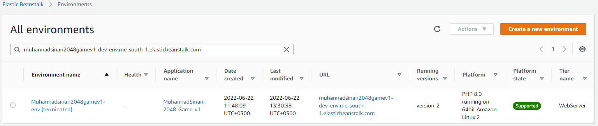

### DevOps

# Day4 - SNS SQS Beanstalk and SSM


1. **Simple EB.**

​          1.1.     Launch the [2048](https://github.com/chandradeoarya/2048.git) application on EB `us-east-1` `php` **`--single instance`**. You must change make the following changes in the code.

> You have to open `index.html` line no. 76 and 80 and give your name and your cohort name in the place of player's name.

***Ans.***


**The Game URL: [http://muhannadsinan2048gamev1-env.eba-aiqtvysv.me-south-1.elasticbeanstalk.com/](http://muhannadsinan2048gamev1-env.eba-aiqtvysv.me-south-1.elasticbeanstalk.com/)**


​          1.2.     Now You must change make the following changes in the code.


You have to open `style/main.css` **line no. 5** and change color `background: #000000;` to `background: #faf8ef;` as blue-green deployment.

And create `version-2` version of the app.
**The Game version-2 URL:** [http://muhannadsinan2048gamev1-env.eba-aiqtvysv.me-south-1.elasticbeanstalk.com/](http://muhannadsinan2048gamev1-env.eba-aiqtvysv.me-south-1.elasticbeanstalk.com/)


​          1.3.     Now perform the blue green deployment using url swap.


|                                                              |
| ------------------------------------------------------------ |
| **The Game version-1 URL:** [http://muhannadsinan2048gamev1-env.eba-aiqtvysv.me-south-1.elasticbeanstalk.com/](http://muhannadsinan2048gamev1-env.eba-aiqtvysv.me-south-1.elasticbeanstalk.com/) |
| **The Game version-2 URL:** [http://muhannadsinan2048gamev1-dev-env.me-south-1.elasticbeanstalk.com/](http://muhannadsinan2048gamev1-dev-env.me-south-1.elasticbeanstalk.com/) |

 

​          1.4.     Terminate the environment. 




   

​          1.5.     Delete the application. 


2. Use aws ssm parameters to store two credentials. **`/dev/db/database_username`** and **`/dev/db/database_password`**. Print that using AWS CLI or python

​     Print that using AWS CLI. Use the commands below in python code or use cli commands.

```python
import json
import boto3
client = boto3.client('ssm')
parameterUsername = client.get_parameter(Name='/dev/db/database_username')
parameterPassword = client.get_parameter(Name='/dev/db/database_password, WithDecryption=True)
print(parameterUsername['Parameter']['Value'])
print(parameterPassword['Parameter']['Value'])
```

| <br /> |
| ------------------------------------------------------------ |
|  |
|  |

 

3. **SNS**

​          3.1.     Create a topic `YourName-Server-down-alert` in SNS


​          3.2.     Create a subscription `YourName-report-admin-email` with subscription type EMAIL


​          3.3.     Confirm the subscription in the email that you receive from AWS.


​          3.4.     Publish a sample message to SNS.


4. **SQS**

​          4.1.     Create an SQS queue with name `YourName-analytics-done`

- Keep parameters as this
- Visibility timeout - 30 sec
- Message retention period - 2 days

 

 

​         4.2.     Send a test message. Paste screenshot of the AWS console.


5. **AWS SSM**

​          5.1.     Create 2 two Amazon linux2 servers and tag one of them as **`Dev`** and Another **`Prod`.** Now create resource group **`OnPremise`** and Add these servers in a **`OnPremise`** resource group


​          5.2.     Create document to install apache as given in the screenshot below and now install apache in the **`OnPremise`** resource group.

YML document code.

```yaml
---
schemaVersion: '2.2'
description: YAML template which will install Apache on an EC2 instance
parameters: 
  InitialWebText:
    type: "String"
    description: "Initial message"
    default: "Welcome to instance "
mainSteps:
- action: aws:runShellScript
  name: configureApache
  inputs:
    runCommand:
    - 'sudo yum update -y'
    - 'sudo yum install -y httpd'
    - 'sudo systemctl start httpd.service'
    - 'sudo systemctl enable httpd.service'
    - 'echo "{{InitialWebText}} $(hostname -f) , running Apache, installed with AWS Systems Manager" > /var/www/html/index.html'
```


