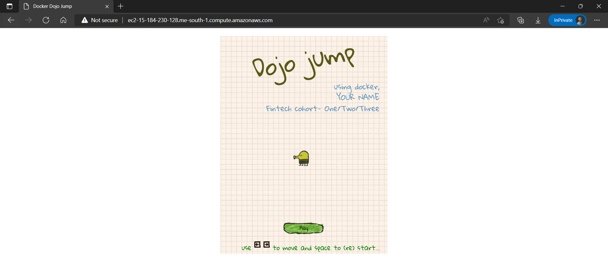

### DevOps

# Day5 - IaC


1. **Cloudformation**

   1.1. Create a cloudformation stack that will:

      1. create a custom VPC, two ec2 servers, two security groups

      2. Bootstrap apache2 server

      3. Store the application content in the `index.html` file printing **your name** and **cohort name**.

      4. this application should be publicly accessible.

      ***Ans.***

      `customVPC.yml`

      ```yaml
      AWSTemplateFormatVersion: 2010-09-09
      Description: Belt Exam 1 Day 5 - creating a custom VPC, two ec2 servers, two security groups with bootstrap apache2 server
      
      Parameters:
        KeyName:
          Description: Name of an existing EC2 KeyPair to enable SSH access to the instance
          Type: AWS::EC2::KeyPair::KeyName
          Default: main
      
      Resources:
        SampleVpc:
          Type: AWS::EC2::VPC
          Description: Sample VPC definition
          Properties:
            CidrBlock: 10.0.0.0/16
            Tags:
              - Key: Name
                Value: SampleVpc
        SampleSubnet:
          Type: AWS::EC2::Subnet
          Properties:
            CidrBlock: 10.0.0.0/24
            MapPublicIpOnLaunch: true
            VpcId: !Ref SampleVpc
        SampleRouteTable:
          Type: AWS::EC2::RouteTable
          Properties:
            VpcId: !Ref SampleVpc
        SampleInternetGateway:
          Type: AWS::EC2::InternetGateway
        SampleGatewayAttachment:
          Type: AWS::EC2::VPCGatewayAttachment
          Properties:
            VpcId: !Ref SampleVpc
            InternetGatewayId: !Ref SampleInternetGateway
        InternetRoute:
          Type: AWS::EC2::Route
          DependsOn:
            - SampleGatewayAttachment
          Properties:
            RouteTableId: !Ref SampleRouteTable
            GatewayId: !Ref SampleInternetGateway
            DestinationCidrBlock: 0.0.0.0/0
        SampleSubnetRouteTableAssoc:
          Type: AWS::EC2::SubnetRouteTableAssociation
          Properties:
            RouteTableId: !Ref SampleRouteTable
            SubnetId: !Ref SampleSubnet
        MyInstance1:
          Type: AWS::EC2::Instance
          Properties:
            ImageId: ami-0bf69afb300c322eb
            InstanceType: t3.micro
            KeyName: !Ref "KeyName"
            SecurityGroups:
              - !Ref HTTPSecurityGroup
              - !Ref SSHSecurityGroup
            Tags:
              - Key: BeltExam1
                Value: Day 5
            UserData:
              Fn::Base64: !Sub |
                #!/bin/bash
                sudo su
                yum update -y
                yum install httpd -y
                chmod -R 777 /var/www/html
                cd /var/www/html
                echo "<h1>Hello DevOps, My name is Muhannad Sinan from onsite cohort</h1>" > index.html
                systemctl start httpd
                systemctl enable httpd
      
        MyInstance2:
          Type: AWS::EC2::Instance
          Properties:
            ImageId: ami-0bf69afb300c322eb
            InstanceType: t3.micro
            KeyName: !Ref "KeyName"
            SecurityGroups:
              - !Ref HTTPSecurityGroup
              - !Ref SSHSecurityGroup
            Tags:
              - Key: BeltExam1
                Value: Day 5
            UserData:
              Fn::Base64: !Sub |
                #!/bin/bash
                sudo su
                yum update -y
                yum install httpd -y
                chmod -R 777 /var/www/html
                cd /var/www/html
                echo "<h1>Hello DevOps, My name is Muhannad Sinan from onsite cohort</h1>" > index.html
                systemctl start httpd
                systemctl enable httpd
      
        SSHSecurityGroup:
          Type: AWS::EC2::SecurityGroup
          Properties:
            GroupName: SSHSecurityGroupApache
            GroupDescription: Enable SSH access to instances via port 22
            SecurityGroupIngress:
              - CidrIp: 0.0.0.0/0
                IpProtocol: tcp
                FromPort: 22
                ToPort: 22
      
        HTTPSecurityGroup:
          Type: AWS::EC2::SecurityGroup
          Properties:
            GroupName: HTTPSecurityGroupApache
            GroupDescription: Allow HTTP traffics to instance in port 80
            SecurityGroupIngress:
              - CidrIp: 0.0.0.0/0
                IpProtocol: tcp
                FromPort: 80
                ToPort: 80
      
      Outputs:
        WebsiteURL1:
          Value: !Sub
            - http://${PublicAddress}
            - PublicAddress: !GetAtt MyInstance1.PublicDnsName
          Description: Application URL
        WebsiteURL2:
          Value: !Sub
            - http://${PublicAddress}
            - PublicAddress: !GetAtt MyInstance2.PublicDnsName
          Description: Application URL
      ```


**`aws cloudformation create-stack --stack-name YourName-customVPC --template-body file://customVPC.yml`**


1.2. Create a cloudformation with:

  1. Default IP 0.0.0.0 and allow only standard IP format.

  2. Allow only t2.nano, t2.micro, t2smaIl, t2.medium instances

  3. Public port 80 access but own-ip 22 access

  4. One instance of Amazon Linux Latest AMI of Amazon Linux taken as parameter

  5. user proper tagging with instance name - `YourName-cloudformation`

  6. Output AZ, DNS, public IP

  ***Ans.***
`OneEC2.yml`

```yaml
AWSTemplateFormatVersion: 2010-09-09
Description: Belt Exam 1 Day 5

Parameters:
  KeyName:
    Description: Name of an existing EC2 KeyPair to enable SSH access to the instance
    Type: "AWS::EC2::KeyPair::KeyName"
    Default: main
  InstanceType:
    Description: WebServer EC2 instance type
    Type: String
    Default: t3.micro
    AllowedValues:
      - t3.nano
      - t3.micro
      - t3.small
      - t3.medium
    ConstraintDescription: must be a valid EC2 instance type.
  IPLocation:
    Description: The IP address range that can be used to SSH to the EC2 instances
    Type: String
      MinLength: '9'
      MaxLength: '18'
      Default: 0.0.0.0/0
      AllowedPattern: '(\d{1,3})\.(\d{1,3})\.(\d{1,3})\.(\d{1,3})/(\d{1,2})'
      ConstraintDescription: must be a valid IP CIDR range of the form x.x.x.x/x

Resources:
  EC2Instance:
    Type: "AWS::EC2::Instance"
    Properties:
      ImageId: ami-0bf69afb300c322eb
      InstanceType: !Ref InstanceType
      SecurityGroups:
        - !Ref InstanceSecurityGroup
      KeyName: !Ref KeyName
      Tags:
        - Key: BeltExam1
          Value: Day 5
        - Key: Type
          Value: Amazon Linux 2
  InstanceSecurityGroup:
    Type: "AWS::EC2::SecurityGroup"
    Properties:
      GroupDescription: Enable SSH access via port 22
      SecurityGroupIngress:
        - IpProtocol: tcp
          FromPort: "22"
          ToPort: "22"
          CidrIp: 192.168.1.30/32
        - IpProtocol: tcp
          FromPort: "80"
          ToPort: "80"
          CidrIp: !Ref IPLocation

Outputs:
  AZname:
    Description: The Availability Zone where the Amazon Linux 2 EC2 instance is launched
    Value: !GetAtt EC2Instance.AvailabilityZone
  PublicDNS:
    Description: The public DNS name of the Amazon Linux 2 EC2 instance
    Value: !GetAtt EC2Instance.PublicDnsName
  PublicIP:
    Description: The public IP address of the Amazon Linux 2 EC2 instance
    Value: !GetAtt EC2Instance.PublicIp
```


**`aws cloudformation create-stack --stack-name YourName-cloudformation --template-body file://OneEC2.yml`**


​      

2. **Terraform**

   2.1. Dojo jump is going to be launched soon. It aims to deploy it in Apache Servers. you and your colleagues have started to work on the project. your Teammate has developed the website and they need your help to build the infrastructure for deploying the website
      Dojo-jump game link - https://github.com/chandradeoarya/dojo-jump

      1. Ubuntu or Amazon Linux in server

      2. Proper ingress and egress

      4. Proper tagging

   <div style="page-break-after:always" />
   ***Ans.***

**`provider.tf`**


```yaml
  terraform {
    cloud {
      organization = "MohanadSinan"
      workspaces {
        name = "aws_terraform"
      }
    }
    required_providers {
      aws = {
        source  = "hashicorp/aws"
        version = "4.18.0"
      }
    }
  }
  
  # Define AWS as a provider
  provider "aws" {
    shared_credentials_files = [ ".aws/credentials" ]
    region = var.aws_region
  } 
```

**`variables.tf`**

  ```yaml
  variable "aws_region" {
    description = "Region for the EC2"
    default     = "me-south-1"
  }
  
  variable "amazon_linux_ami" {
    description = "Amazon linux AMI for EC2"
    default     = "ami-0e0d82dfd5f84879e"
  }
  
  variable "instance_type" {
    description = "instance type"
    default     = "t3.micro"
  }
  
  variable "key_path" {
    description = "SSH Public Key path"
    default     = "key.pub"
  }
  ```

  **`main.tf`**

  ```yaml
  # Define SSH key pair the instances
  resource "aws_key_pair" "default" {
    key_name   = "key"
    public_key = file("${var.key_path}")
  }
  
  # Define the security group
  resource "aws_security_group" "sgweb" {
    name        = "DojoJump-SG"
    description = "Allow incoming HTTP connections & SSH access"
  
    ingress {
      description = "Allow incoming HTTP connections"
      from_port   = 80
      to_port     = 80
      protocol    = "tcp"
      cidr_blocks = ["0.0.0.0/0"]
    }
  
    ingress {
      description = "Allow incoming SSH access"
      from_port   = 22
      to_port     = 22
      protocol    = "tcp"
      cidr_blocks = ["0.0.0.0/0"]
    }
  
    egress {
      from_port   = 0
      to_port     = 0
      protocol    = "-1"
      cidr_blocks = ["0.0.0.0/0"]
    }
  
    tags = {
      Name = "DojoJump SG"
    }
  }
  
  # Define an Amazon Linux instance with Apache web server
  resource "aws_instance" "DojoJump" {
    ami                    = var.amazon_linux_ami
    instance_type          = var.instance_type
    key_name               = aws_key_pair.default.id
    vpc_security_group_ids = ["${aws_security_group.sgweb.id}"]
    user_data              = file("install.sh")
  
    tags = {
      Name = "MuhanadSinan-DojoJump"
    }
  }
  ```

  **`install.sh`**

  ```bash
  #!/bin/sh
  # Install Apache web server in Amazon Linux AMI with DojoJump game
  sudo su
  yum update -y
  yum install -y httpd.x86_64
  chmod -R 777 /var/www/html
  cd /var/www/html
  wget https://raw.githubusercontent.com/chandradeoarya/dojo-jump/master/style.css
  wget https://raw.githubusercontent.com/chandradeoarya/dojo-jump/master/main.js
  wget https://raw.githubusercontent.com/chandradeoarya/dojo-jump/master/index.html
  systemctl start httpd.service
  systemctl enable httpd.service
  ```

  **`output.tf`**

  ```yaml
  output "instance_id_DojoJump" {
    description = "Instance ID"
    value       = aws_instance.DojoJump.id
  }
  
  output "instance_public_ip_DojoJump" {
    description = "Instance Public IP"
    value       = aws_instance.DojoJump.public_ip
  }
  
  output "instance_AZ_name_DojoJump" {
    description = "availability zone"
    value       = aws_instance.DojoJump.availability_zone
  }
  
  output "instance_public_dns_DojoJump" {
    description = "Instance public dns for class main"
    value       = aws_instance.DojoJump.public_dns
  }
  ```

**`terraform init`**


​      **`terraform apply`**
          


​      




​      

   2.2. Terraform custom module:

1. Let us consider that an organization “CodingDojo” has a blueprint of a prototype of an application “Payroll” that needs to deploy at several countries. Each country will have its own instance of software deployed on an AWS instance using the same architecture.

  Architecture design:


**Important checkpoints:**

  1. It consists of a single ec2instance using the custom AMI, that holds the application server.
  2. A DynamoDB NoSQL database that will be used to store the data of the employees
  3. S3 bucket which will be used to save tax and other documents.
  4. Users can access the application through this EC2 instance.
  5. This is the architecture of the application in most simplified form.
  6. Default VPC and subnets are used.
  
     
     
     Create a custom module to deploy the whole application infrastructure.
     
     Use this module to deploy the application in `us-east-1`. 
     
     Paste the screenshot of the resources created. Paste all the template yml files like output, variable, main etc.

   ***Ans.***

I created a Terraform custom module with this set of files:

- `Terraform-project`
  - `Application-module`
    - `dynamo_db.tf`
    - `ec2_instance.tf`
    - `providers.tf`
    - `S3_bucket.tf`
    - `terraform.tf`
    - `variable.tf`
  - `uk-application`
    - `main.tf`
  - `us-application`
    - `main.tf`

<div style="page-break-after:always" />

**`Application-module`  >  `dynamo_db.tf`**

```yaml
resource "aws_dynamodb_table" "db" {

    name = "employees_data"
    billing_mode = "PAY_PER_REQUEST"
    hash_key = "EmployeeID"

    attribute {
      name = "EmployeeID"
      type = "N"
    }
}
```

**`Application-module`  > `ec2_instance.tf`**

```yaml
resource "aws_instance" "app_server" {
    ami = var.ami
    instance_type = "${var.instance_type}"
    tags = {
        Name = "${var.app_region}-app-server"
    }
}
```

**`Application-module`  > `providers.tf`**

```yaml
provider "aws" {
  profile = "default"
  region  = var.app_region
}
```

**`Application-module`  > `S3_bucket.tf`**

```yaml
resource "aws_s3_bucket" "data" {
  
  bucket = "${var.app_region}-${var.bucket}"
}
```

<div style="page-break-after:always" />
**`Application-module`  > `terraform.tf`**

```yaml
terraform {
  required_providers {
    aws = {
      source  = "hashicorp/aws"
      version = "~> 3.27"
    }
  }
}
```

**`Application-module`  > `variable.tf`**

```yaml
variable "app_region" {
  type = string
  description = "This variable stores the region of the application deployed"
}

variable "bucket" {
  type = string
  description = "This variable stores the name of the bucket"
}

variable "ami" {
  type = string
  description = "This variable stores the ami image name"
}

variable "instance_type" {
  type = string
  description = "This variable stores the ami type"
}
```

**`Application-module`  > `vpc.tf`**

```yaml
# Define the security group for public subnet
resource "aws_security_group" "sgweb" {
  name        = "vpc"
  description = "Allow incoming HTTP connections & SSH access"

  ingress {
    from_port   = 22
    to_port     = 22
    protocol    = "tcp"
    cidr_blocks = ["0.0.0.0/0"]
  }

  ingress {
    from_port   = 80
    to_port     = 80
    protocol    = "tcp"
    cidr_blocks = ["0.0.0.0/0"]
  }

  egress {
    from_port   = 0
    to_port     = 0
    protocol    = "-1"
    cidr_blocks = ["0.0.0.0/0"]
  }

  tags = {
    Name = "custom SG"
  }
}
```

**`uk-application` >  `main.tf`**

```yaml
module "uk-application" {
  
  source = "../Application-module"
  app_region = "eu-west-2"
  bucket = "tax-documents"
  ami = "ami-078a289ddf4b09ae0"

}
```

**`us-application` >  `main.tf`**

```yaml
module "us-application" {
  
  source = "../Application-module"
  app_region = "us-east-1"
  bucket = "tax-documents"
  ami = "ami-083602cee93914c0c"

}
```

**Run this commands in `Terraform module/Terraform-project/us-application` directory:**
`terraform init`
`terraform apply --auto-approve`


